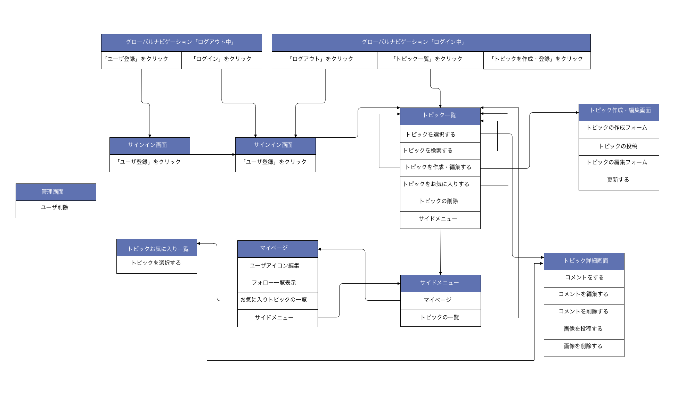

# タイトル
## 『Animex』  
# コンセプト
## 好きなアニメについて話したい人が交流できる場所
Animexはあなたが見ているアニメについて話す場所です。  
アニメ好きが繋がりを構築できる場所を提供することが目的のアプリです。  
トピックごとにコメントを行うことができる。  
遠く離れた同じ趣味を持つ仲間と出会い、盛り上がりましょう！  
## 制作背景
1. 私自身が毎クール必ず録画して見ている無類のアニメ好きであること。  
　(1クール＝3ヶ月、アニメやドラマは1クールごとに新しい作品が始まります。１クール以上続く作品ももちろんあります。)  
2. アニメを見ることが物心ついた頃から30年くらい無意識に続いてしまっている唯一無二の趣味であること。  
3. 毎日Youtubeを見ているのですが、1つの動画に対してコメント欄でいろんな意見を見れることがとても楽しいと感じ、同じようなことを好きで見ているアニメでもやってみたいと思ったこと。  
4. 30年近くアニメを見てきたが、意外とアニメに特化したコミュニティや手軽に会話できる場がないと感じている。(私自身が見つけられてないだけかも知れません。)  
5. 基本私が見ているアニメは深夜にやっていることが多く、その次の日の朝や仕事終わりに見ることが多いのですが、そういう隙間時間でも”気軽に”語れる場所が欲しいと思っていたこと。 
  
以上がこのアプリを作ろうという思いに至った制作背景であります！  
## バージョン
* Ruby 2.6.5
* Ruby on Rails 5.2.5
* PostgreSQL 13.2
## 就業Termの技術
* フォロー機能  
* お気に入り機能
## カリキュラム外の技術
* Vue.js  
## 機能一覧
- topicごとのCRUD機能(文章・画像の投稿、編集・削除)
- お気に入り一覧表示機能
- topicのお気に入り機能
- topicの作成・登録機能
- コメント機能
- ユーザ登録機能
- ユーザ管理機能
- ログイン機能
- ゲストログイン機能
- フォロー機能
- 管理者権限機能
- topic検索機能
- Heroku
## 実行手順
```
$ git clone https://github.com/takuya-png/Animex
$ cd Animex
$ bundle install
$ rails db:create rails db:migrate
$ rails s
```
## カタログ設計
https://docs.google.com/spreadsheets/d/1XjkHxGKZynnLdD60erqMfycNzm9x-eXxxyZ72N6KUuc/edit#gid=0
## テーブル定義
https://docs.google.com/spreadsheets/d/15Fg8UlFJgCzs3iSK7OVQr5c7elfwkjDeZ_2AwCJpGMw/edit#gid=0
## ER図


## ワイヤーフレーム
https://cacoo.com/diagrams/L32TYbKvqoohQ3Xv/08EBF
## 画面遷移図

